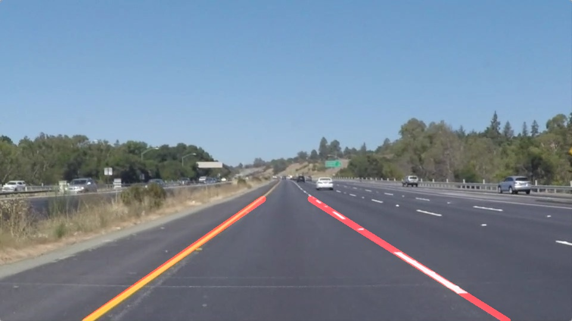
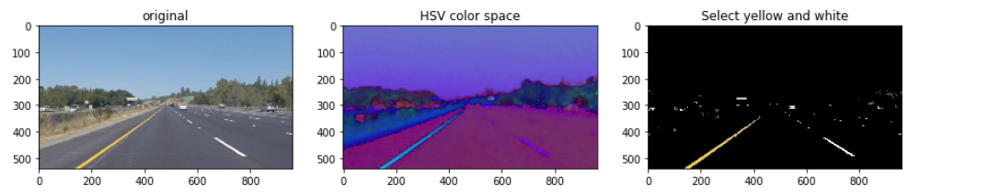
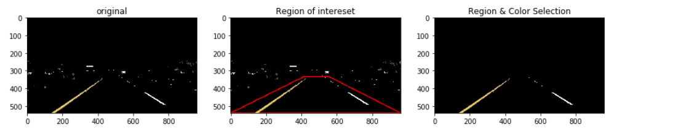
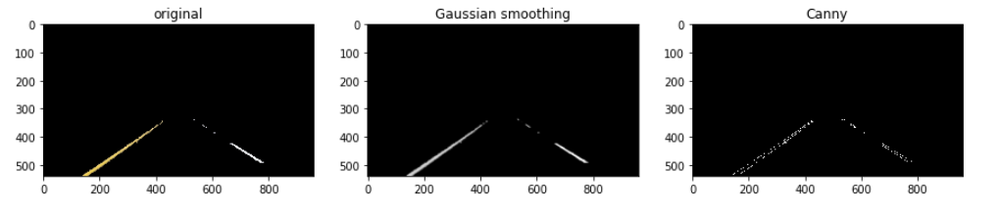
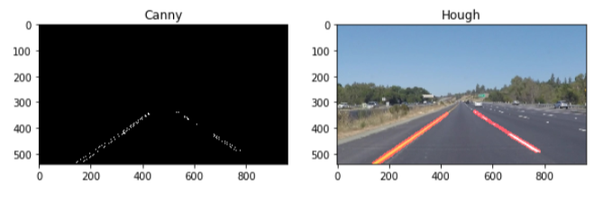
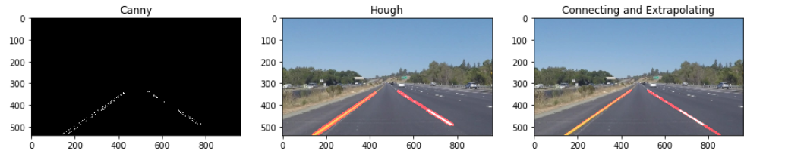

# **Finding Lane Lines on the Road** 



## Overview

When we drive, we use our eyes to decide where to go.  The lines on the road that show us where the lanes are act as our constant reference for where to steer the vehicle.  Naturally, one of the first things we would like to do in developing a self-driving car is to automatically detect lane lines using an algorithm.

In this project you will detect lane lines in images using Python and OpenCV.  OpenCV means "Open-Source Computer Vision", which is a package that has many useful tools for analyzing images.  


## Set up the [CarND Term1 Starter Kit](https://classroom.udacity.com/nanodegrees/nd013/parts/fbf77062-5703-404e-b60c-95b78b2f3f9e/modules/83ec35ee-1e02-48a5-bdb7-d244bd47c2dc/lessons/8c82408b-a217-4d09-b81d-1bda4c6380ef/concepts/4f1870e0-3849-43e4-b670-12e6f2d4b7a7) 

## Write up

The following tools are used:
* color selection
* region of interest selection
* Gaussian smoothing
* Canny Edge Detection
* Hough Tranform


### Read in a test image


The upper part of the image is the sky and the lower part is the road. On the left side of the road is a solid yellow line and on the right are white line segments.I need to draw just one line for the left side of the lane and one for the right.


### Color Selection

This image is in RGB color space.In order to better detect yellow line and white line,I need to convent the image from RGB space to HSV space.


```python
    # yellow theshold
    lower_yellow = np.array([20,80,50])
    upper_yellow = np.array([40,255,255])
    
    # white theshold
    lower_white = np.array([0,0,220])
    upper_white = np.array([180,25,255])
    
    #convent image from RGB color space to HSV color space
    hsv_img = cv2.cvtColor(img,cv2.COLOR_RGB2HSV)
    
    # select yellow and white
    yellow_mask_img = cv2.inRange(hsv_img,lower_yellow,upper_yellow)
    white_mask_img = cv2.inRange(hsv_img,lower_white,upper_white)
    
    #conbine yellow and white
    mask_img = cv2.bitwise_or(yellow_mask_img,white_mask_img)
    
    # Bitwise-AND mask and original image for showing
    color_mask_img = cv2.bitwise_and(img,img, mask= mask_img)

```



### Region of Interest Selection

After the color selection, most of the content that is not related to the road line has been filtered out. Assuming the position of the camera is fixed, the road line will often appear in the same region.It's very important to find the region that I would like to retain for my color selection, while masking everything else out. 


```python
    # get size of image
    ysize = image.shape[0]
    xsize = image.shape[1]

    # edge points of interest regions
    left_bottom = [0,ysize]
    right_bottom = [xsize,ysize]
    left_apex =[int(0.45*xsize),int(0.62*ysize)]
    right_apex = [int(0.58*xsize),int(0.62*ysize)]
    
    #region of interest
    vertices = np.array([[left_bottom,left_apex,right_apex, right_bottom]], dtype=np.int32)
    region_img = region_of_interest(img,vertices)
```



### Gaussian Smoothing and Canny Edge Detection

With edge detection，the goal is to identify the boundaries of an object in an image.Some OpenCV functions used are as follow:

* `cv2.cvtColor(img,cv2.COLOR_RGB2GRAY)`for Grayscale transforming
* `cv2.GaussianBlur(img,(kernel_size,kernel_size),0)` for Gaussian Smoothing
* `cv2.Canny(img,low_threshold,high_threshold)` for Canny transforming

**Note:**
* the kernel_size for Gaussian Smoothing must be any odd number.The bigger the value is,the more blurred the image becomes.I tried 3,5,7,9,11 and finally chosed 9.
* low_threshold and high_threshold for Canny are the thresholds for edge detection.As far as a ratio of lew_threshold and high_threshold ,John Canny himself recommended a low to high ratio of 1:2 or 1:3



### Hough Tranform

The Hough Transform is just the conversion from image space to Hough space.I used an OpenCV function called HoughLineP to find the lane lines in the image.

`lines = cv2.HoughLinesP(img, rho, theta, threshold, np.array([]), minLineLength=min_line_len, maxLineGap=max_line_gap)`


* rho = 1            :distance resolution in pixels of the Hough grid
* theta = np.pi/180  :angular resolution in radians of the Hough grid
* threshold = 30     :minimum number of votes (intersections in Hough grid cell)
* min_line_length = 20 :minimum number of pixels making up a line
* max_line_gap = 250   :maximum gap in pixels between connectable line segments



### Improve the draw_lines() function

I have deceted the line segments in the image.Then,I need to connect them and draw them onto the image for display.To do this, I need improve the draw_lines() function.

First,I calculate the slope of each line segments separately.If the slop is greater than zero,it belongs to the right part,otherwise to the left part. Because the y coordinate is reversed.

Second,I average the points and slopes on the left.Then,I extrapolate to the top and bottom of the lane.I do the same thing on the right.

Then,I use cv2.line to draw left line and right line on the image.


```python
def draw_lines(img, lines, color=[255, 0, 0], thickness=10,extrapolate = False):
    left_point = []
    right_point = []
    left_slope = []
    right_slope = []

    if lines is not None:

        for line in lines:
            for x1,y1,x2,y2 in line:

                # calculate slope
                slope = (y2-y1)/(x2-x1)

                if slope < -0.3: # left lines,filter out the horizontal lines

                    left_point.append((x1,y1))
                    left_point.append((x2,y2))
                    left_slope.append(slope)

                elif slope > 0.3:# right lines,filter out the horizontal lines

                    right_point.append((x1,y1))
                    right_point.append((x2,y2))
                    right_slope.append(slope)

        # average postion all points of left and right,average slope
        left_point = np.array(left_point)
        right_point = np.array(right_point)
        left_slope = np.array(left_slope)
        right_slope = np.array(right_slope)

        if len(left_point):


            # Average the left points  and slope
            x = np.average(left_point[:,0])
            y = np.average(left_point[:,1])
            left_slope = np.average(left_slope)

            # calculate tow points of left line
            left_top = (int(0.62 * img.shape[0]) - y)/left_slope + x
            left_bottom = (img.shape[0] - y) / left_slope + x

            #draw left line
            cv2.line(img,(int(left_bottom),img.shape[0]),(int(left_top),int(0.62 * img.shape[0])),color,thickness)  


        if len(right_point):

            # Average the right points  and slope
            x = np.average(right_point[:,0])
            y = np.average(right_point[:,1])
            right_slope = np.average(right_slope)

            # calculate tow points of right line
            right_top = (int(0.62 * img.shape[0])  - y) / right_slope + x
            right_bottom = (img.shape[0] - y) / right_slope + x

            # draw right line
            cv2.line(img,(int(right_bottom),img.shape[0]),(int(right_top),int(0.62 * img.shape[0])),color,thickness)    

```




